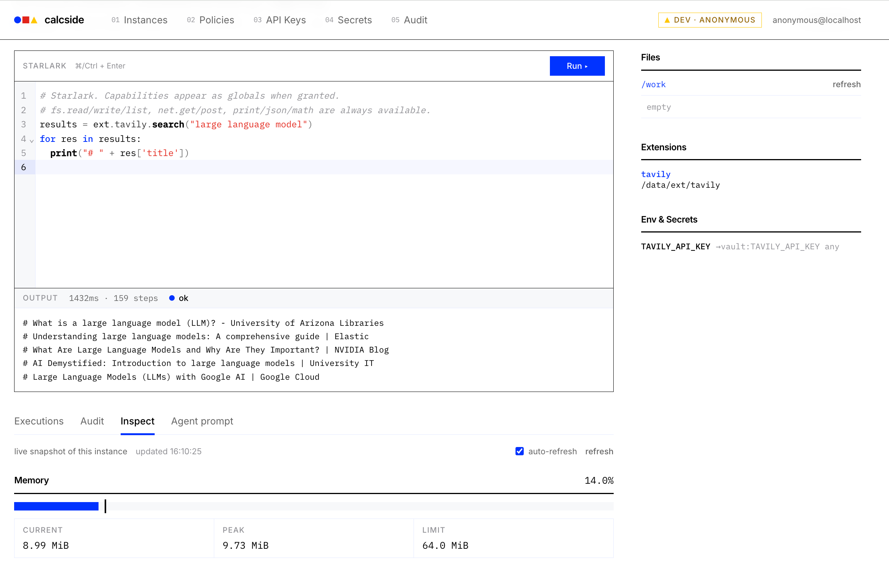

# calcside



A lightweight code-execution sandbox for AI agents, built on Starlark. There are no containers and no virtual machines: **capabilities are the security boundary**. An agent writes a Starlark script; the only globals it sees are the capabilities it was granted, and every operation those capabilities perform is gated, policy-checked, and audited.

The design follows [citron](https://github.com/mishudark/citron), a Go implementation of the capability-safe agent harness from *[Tracking Capabilities for Safer Agents](https://arxiv.org/abs/2603.00991)* (Odersky et al., CAIS '26). Where the paper enforces safety statically via Scala 3 capture checking and citron via AST analysis, calcside takes the runtime route: a per-instance **Gate** mediates every side effect, Rego policies can veto ops before and after they run, and secrets are injected into outbound requests at send time — scripts can reference them but never read them.

## Quick start

Install Atlas CLI 1.2.2 for local development and database tests. `make dev` and `make serve-dev` apply migrations before starting the API.

```bash
make build                 # web console + bin/calcside + bin/calcside-worker
make dev                   # backend (--dev, anonymous) on :8787 + Vite console on :5173 — no login
```

Use the web console at `http://localhost:5173`, or integrate through the HTTP API or [Python SDK](sdk/python/README.md). With the SDK installed, connect to the dev server from your application:

```python
from calcside import Client

with Client(base_url="http://127.0.0.1:8787", api_key="") as client:
    instance = client.create_instance({"capabilities": {"fs": {}}, "ttl_seconds": 900})
    try:
        result = client.exec(instance["id"], 'fs.write("a.txt", "hi")\nprint(fs.read("a.txt"))')
        print(result.output, end="")
    finally:
        client.delete_instance(instance["id"])
```

Outside dev mode, create an API key in the web console and pass it via `CALCSIDE_API_KEY` or the SDK's `api_key` argument. Manage library policies through the console or `/api/v1/policies`, then select them in the instance spec.

Instance spec (`POST /api/v1/instances`):

```json
{"ttl_seconds": 900, "labels": {"team": "x"},
 "capabilities": {"fs": {"quota_bytes": 67108864}, "net": {"allow_hosts": ["api.github.com"]}, "io": {}},
 "policies": ["builtin.block_private_network", "deny_net_hosts"],
 "limits": {"exec_timeout_ms": 30000, "max_steps": 10000000, "max_output_bytes": 1048576}}
```

For an instance that needs internal HTTP access, pass `"policies": []` (or an explicit list without `builtin.block_private_network`). This does not bypass the instance's host allowlist, secret domain restrictions, or mandatory server policies. No network capability means no network access regardless of policy selection.

## Built-in utilities

Every instance and extension has `json`, `math`, `url`, `csv`, `base64`, `hashlib`,
`regex`, and `datetime`. These are bounded pure functions, not capability grants:
no implicit I/O, secrets, current clock, randomness, or host timezone. The server
prompt and editor completion describe their signatures and limits.

```python
rows = csv.parse_dicts("id,amount_minor\nA,1200\nB,300\n")
selected = [r for r in rows if int(r["amount_minor"]) > 1000]
fs.write("output/selected.csv", csv.format_dicts(selected, columns=["id", "amount_minor"]))
print(url.query_encode({"tag": ["agent", "sandbox"], "q": "CSV analysis"}))
```

CSV cells remain strings; use integer minor units for money. Dates use Unix
milliseconds and explicit UTC/offset inputs. Base64 decoding returns bytes;
text utilities require explicit decoding. Regex uses RE2 (not Python regex),
UTF-8 byte offsets, and literal replacement strings. Module names are reserved
predeclared bindings; rename existing script variables that used these names.

Limits include 8 MiB general input/output, 10,000 CSV records / 100,000 cells,
256 CSV columns / 256 KiB fields, 64 KiB URLs / 1,024 query pairs, and 1 MiB regex
text / 8 KiB patterns / 10,000 matches, with a separate pattern-complexity bound.

## Artifacts: preview and download

Write outputs with `fs.write`, then use the instance's Files list. Each file has
preview and download icons; preview opens a dedicated page in a new tab without
interrupting the editor. The viewer provides Preview/Source, refresh, download,
CSV table headers and HTML desktop/mobile widths. JavaScript requires explicit
confirmation; switching to Source stops it. Select files/directories in the list
for ZIP export. No disk backend or publication step is required; files remain in
the memory VFS.

HTML previews automatically embed local stylesheet and script references into a
single in-memory HTML snapshot using esbuild's Go API. No resource directory
selection, Node.js, browser process, or filesystem mount is needed. For example,
`/work/report/index.html` can reference `./styles.css` and `./chart.js`; nested CSS
`@import` and a module entry's relative JS/MJS/JSON imports (including literal
`import("./part.js")`) are bundled too. Dependency paths must stay within the HTML
entry's directory; no CDN, package registry, host files, or parent directories are
read. Only referenced files are captured, each with Gate checks and redaction,
under the same execution lock as the entry. A denied, missing, unsupported, or
oversized JS/CSS dependency fails the preview instead of returning a partial
report. Deploy the API and execution nodes together for conversion support.

CSS is embedded as style elements. External scripts are compiled and embedded as
base64 data URLs so classic globals, `defer`, `async`, and module scheduling retain
native browser behavior. Static mode never reads or executes script dependencies.
Interactive mode is still explicit. Supported module previews have one module
entry; import maps, integrity-checked resources, binary image/font dependencies,
non-literal module imports/glob discovery, and runtime data fetching are not
supported. Runtime-computed URLs are not rewritten. Pre-embedded data images remain
subject to CSP. This is a report packager, not a general website build system.

Source view and downloads remain the original redacted file, not the converted
preview. Download the report directory as ZIP when you need its dependent files.

All exports pass through per-file Gate checks and known-secret redaction. ZIP
capture is serialized against execution, preserves `/work`-relative paths and
empty directories, and fails entirely on denied, missing, unsupported, colliding,
or oversized entries. Downloads preserve bytes unless redaction is required;
spreadsheet formulas are not silently rewritten. Use `spreadsheet_safe=True`
when generating CSV for that purpose. Downloaded HTML runs outside the viewer's
controls when opened locally.

| Limit | Current value |
|---|---|
| Supported files | NUL-free UTF-8 text: CSV/TSV, HTML, JSON, Markdown, CSS/JS, XML, YAML, SQL, text/log, or extensionless text |
| File / total source and redacted bytes | 1 MiB / 4 MiB |
| Files / expanded entries / ZIP response | 100 / 256 / 8 MiB |
| Paths | 1,024 bytes, 255 bytes per component, at most 32 levels below `/work`; portable names with NFC/case-fold collision checks |
| Source preview | 64 KiB, visibly marked when truncated |
| CSV table preview | 200 rows, 32 columns, 512 bytes per cell, 256 KiB displayed text; full bounded input is parsed |
| HTML markup | 8,192 tokens, nesting 64, 64 attributes per tag, 16,384 attributes total, 64 KiB per input tag |
| Inline preview | 100 files / 4 MiB source and redacted dependencies, including the entry; final HTML including base64 expansion at most 1 MiB |
| Capture / concurrent artifact requests | 10 seconds / 4 operations |
| HTML snapshot access | 120 seconds, never beyond instance expiry |
| Preview cache per API process | 128 snapshots / 32 MiB / 16 snapshots per user; a new preview replaces the previous one for that instance |

A preview is a snapshot; later downloads read current VFS state. New reads and
preview loads fail after deletion, expiry, or execution-node loss. Previewing does
not renew the instance. Already delivered bytes cannot be revoked. Neither the
VFS nor the preview cache provides durable artifact retention.

### Configure isolated HTML previews

Rendered HTML is disabled until a separate preview origin is configured; there
is no same-origin fallback. Static mode uses a restricted HTML/simple-SVG
allowlist and constrained style attributes. Compiled local stylesheets are embedded;
scripts, remaining links, forms, frames, images, and unsupported markup are removed.
Interactive mode is a separate explicit action and is disabled by default at
deployment level.

For example, with a console at `https://console.example.com` and a separately
owned preview domain:

```dotenv
CALCSIDE_CONSOLE_ORIGIN=https://console.example.com
CALCSIDE_ARTIFACT_PREVIEW_BASE_URL=https://reports.example.net
CALCSIDE_ARTIFACT_ALLOW_SCRIPTS=false
```

There are exactly two public address settings: `CALCSIDE_CONSOLE_ORIGIN`
(`--console-origin`, default `http://localhost:8080`) and
`CALCSIDE_ARTIFACT_PREVIEW_BASE_URL` (`--artifact-preview-base-url`, empty disables
rendered HTML). The console origin is the single source for the UI origin,
Google OAuth callback URL, and preview CSP `frame-ancestors`. Both accept a scheme,
host and optional port, not page paths. Preview-enabled production deployments
must use HTTPS and different registrable domains, not just different ports or
sibling subdomains. `--artifact-allow-scripts` remains a separate opt-in switch,
not an additional address.

`CALCSIDE_BASE_URL` / `--base-url` and `CALCSIDE_ARTIFACT_CONSOLE_ORIGIN` /
`--artifact-console-origin` have been removed without aliases or fallback logic.
Migrate their console address to `CALCSIDE_CONSOLE_ORIGIN`; a nonempty obsolete
environment variable causes startup to fail with a migration message.

Provision wildcard DNS and a wildcard certificate for `*.reports.example.net`.
Route those hosts to the API listener **without rewriting the Host header**.
The outer host router serves only a ticketed snapshot at `/`; it never forwards
preview hosts to API, login, worker-callback, or console routes. No credentials
from the console are put in the report. Keep cookies host-only, do not configure
credentialed CORS for previews, and remove query strings from preview ingress/CDN
access logs: the short-lived `ticket` query value is a bearer credential. The
application does not log these preview requests. Relative JS/CSS dependencies are
embedded during capture, never served as separate routes; CDN libraries are not
fetched. The console host serves the UI, API and `/auth` routes together; there is
no separately configurable API origin.

Both the iframe and the HTTP response enforce sandboxing without
`allow-same-origin`. CSP blocks fetch/XHR, external scripts/styles, frames, workers,
forms and base changes; permissions policy disables sensitive device/storage APIs.
Interactive CSP allows inline and embedded data-URL scripts, not network script
origins. Conversion parses/compiles JS but does not execute it. Conversion runs in
the instance process with bounded inputs and cooperative cancellation, not under
the Starlark instruction meter; use process isolation and cgroup limits when hard
compiler resource isolation is required.
**This is not a network firewall:** interactive JavaScript may navigate its own
frame, and browser execution is outside Starlark CPU/memory limits. Keep interactive
mode disabled for strict no-egress requirements. When enabled, the UI still
requires the user to click **Run interactive preview**.

Preview caches are local to one API process. A single API can use remote workers
and subprocess isolation normally. With multiple API replicas, assign each replica
its own preview base domain/routing (and wildcard certificate) so issued hosts reach
the process holding the snapshot; sharing one preview base behind an arbitrary
load balancer will produce unavailable previews. A shared/persistent cache is not
implemented.

For local development only, `--dev` permits HTTP on reserved `.localhost` domains,
for example `--artifact-preview-base-url=http://preview.localhost:8787` with
`--console-origin=http://localhost:5173`. The browser must resolve random
`*.preview.localhost` names to loopback. Do not use this exception for production.

Public APIs are `GET /api/v1/artifacts/config`,
`POST /api/v1/instances/{id}/artifacts/preview` (`path`, `mode`), and
`POST /api/v1/instances/{id}/artifacts/export` (`paths`, `format: file|zip`). The
Python SDK exposes `preview_artifact`, `download_file`, and `export_files` on both
sync and async clients.

Browser regressions use a fresh temporary database/server and never modify a
running deployment. Run `PLAYWRIGHT_CHANNEL=chrome pnpm -C web test:browser` with
local Chrome, or install Playwright Chromium and run `pnpm -C web test:browser`.
Do not run Go builds concurrently with `pnpm -C web build`: Vite clears `web/dist`
while Go embeds that directory.

## Database migrations

SQLite is the default; PostgreSQL is selected with `--store postgres` and a PostgreSQL DSN. The server only connects to the database: **run migrations before starting it**. Atlas CLI manages migration history, checksums, locks, and transactions; the application binary does not need Atlas installed.

```bash
export ATLAS_DB_URL="sqlite://$(pwd)/calcside.db"
make migrate-apply
make migrate-status
bin/calcside serve --dsn calcside.db
```

For PostgreSQL, set `ATLAS_DB_URL` to the database URL with `search_path=public`, then run `make migrate-apply MIGRATION_ENV=postgres`. Start the server with `--store postgres` and the corresponding `--dsn` (or `CALCSIDE_STORE` / `CALCSIDE_DSN`). Supply real credentials through your deployment's secret configuration, not committed files.

To add a migration:

```bash
make migrate-new name=add_user_avatar
# Hand-write the SQLite and PostgreSQL SQL in the two new files.
make migrate-hash
make migrate-validate
make test-postgres
```

The files live in `internal/store/gormstore/migrations/{sqlite,postgres}` and share a version and name. Keep GORM row structs in sync, but do not generate SQL from them. Never modify an applied migration; add a new one instead. `migrate-validate` checks both directories' checksums. Go database tests apply the migrations to fresh SQLite databases; `make test-postgres` applies them and runs the same store conformance suite on disposable PostgreSQL databases (Docker required).

For an existing **unversioned SQLite database**, back it up and confirm its schema already matches `20261004092922_baseline.sql` before marking the baseline:

```bash
atlas migrate apply --env sqlite --baseline 20261004092922
```

This uses `ATLAS_DB_URL`, records the baseline without executing its CREATE statements, and applies later migrations. It does **not** upgrade an older schema; in particular, a database still carrying `policies.enabled` needs a separately reviewed upgrade first. Do not pass `--baseline` for an empty database.

## Run with Docker

```bash
make docker-env                    # first run: generates docker/.env with a random shared key
docker compose -f docker/docker-compose.yml up --build
```

Compose first runs the pinned Atlas image as a one-shot `migrate` service and starts the API only after it succeeds. The migration service and API share `docker/data`; existing unversioned databases need the explicit baseline step above. For PostgreSQL, set `CALCSIDE_STORE=postgres`, `CALCSIDE_DSN`, and `ATLAS_DB_URL` to the same database/schema.

Compose starts the API (`:8080`) plus one execution worker; the API forwards instance execution to it over an HMAC-authenticated internal protocol. Drop local extensions into `docker/data/ext/` (bind-mounted) — workers resolve them through the API. See `docker/.env.example` for the remaining env knobs.

## LangChain integration

`sdk/python` ships a `calcside` client and `CalcsideMiddleware` for
LangChain v1 agents. It registers `calcside_exec` / `calcside_list_files` /
`calcside_read_file` tools and injects a system prompt describing the
granted capabilities, Starlark-vs-Python differences, and secret/env
usage.

```python
from langchain.agents import create_agent
from calcside.langchain import CalcsideMiddleware

agent = create_agent(model, tools=[], middleware=[
    # fresh sandbox per run, deleted afterwards:
    CalcsideMiddleware(spec={"capabilities": {"fs": {}}, "ttl_seconds": 900}),
    # or reuse one across runs: CalcsideMiddleware(instance_id="ins_...")
])
```

See [sdk/python/README.md](sdk/python/README.md) for install, modes, and
lifecycle details.
