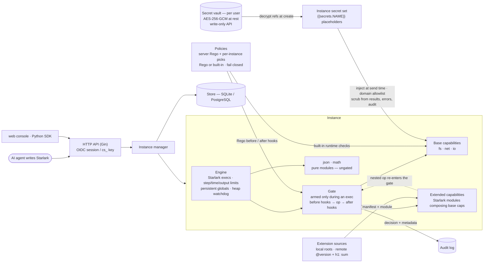

# calcside


A lightweight code-execution sandbox for AI agents, built on Starlark. There are no containers and no virtual machines: **capabilities are the security boundary**. An agent writes a Starlark script; the only globals it sees are the capabilities it was granted, and every operation those capabilities perform is gated, policy-checked, and audited.

The design follows [citron](https://github.com/mishudark/citron), a Go implementation of the capability-safe agent harness from *[Tracking Capabilities for Safer Agents](https://arxiv.org/abs/2603.00991)* (Odersky et al., CAIS '26). Where the paper enforces safety statically via Scala 3 capture checking and citron via AST analysis, calcside takes the runtime route: a per-instance **Gate** mediates every side effect, Rego policies can veto ops before and after they run, and secrets are injected into outbound requests at send time — scripts can reference them but never read them.

## Architecture



Every capability call — including the base-capability calls an extension makes internally — flows through the same pipeline: **armed check → before hooks (policy veto) → op → after hooks → audit record**. When an exec ends the Gate is disarmed, so capability references that leak past their exec fail with `out_of_scope`.

## Concepts

- **Auth**: Google SSO (OIDC) sessions for humans; `cs_` API keys for tools — sha256-hashed at rest, managed only from a logged-in session, unable to mint new keys. `--dev` skips login (anonymous principal, loopback-only).
- **Instance**: a long-lived Starlark interpreter with its own in-memory VFS and persistent globals. It uses a sliding idle TTL; an exec or keepalive renews it. Lifecycle: create / exec / delete / expire.
- **Capability**: the globals an instance is granted. A capability that isn't granted simply doesn't exist in the script.
  - `fs`: in-memory VFS rooted at `/work`, with a quota, a file limit, and a read-only option. Path escapes are rejected.
  - `net`: HTTP with a host allowlist (exact, `*.suffix`, or `host:port`). Self-resolved DNS, IP pinning, and redirect re-checks. The default-selected built-in policy `builtin.block_private_network` rejects private, loopback, link-local, and reserved addresses; deselect it for an instance to allow internal services. Host allowlists and secret-domain restrictions still apply.
  - `io`: `print` / `io.println`, with bounded output.
  - `ext`: **extended capabilities** — Starlark modules that compose base capabilities into higher-level ops (e.g. a `search` op built on `net`). Declared by a `capability.yaml` manifest (name, version, dependencies, ops, config); every nested op still routes through the Gate. Sources are opt-in on the server: local directories (`--ext-local-roots`) or remote git refs (`--ext-allow-sources`, cached under `--ext-cache-dir`); remote sources must be pinned `@version` with an `h1:` integrity sum, and require the git CLI at fetch time. See [docs/extensions.md](docs/extensions.md) for how to write and distribute one; `examples/capabilities/tavily` is a complete example.
  - `json` and `math` are pure modules and are always available.
- **Env**: `spec.env` is a map of non-sensitive `SCREAMING_SNAKE` values readable via the frozen `env` dict (`env.get("X")`, `env["X"]`, `env.keys()`).
- **Secret**: a value scripts can never read. Reference one as `{{secrets.NAME}}` in net URLs, header values, or bodies — the net capability injects the plaintext at send time, only when the target host matches the secret's domain allowlist (https required unless `--secrets-allow-http`), and scrubs it from responses, errors, audit, and policy input. The `secrets` global exposes only `secrets.names()`.
  - **Inline** secrets are per-instance: `value` + `allowed_domains` in the spec, memory-only, never persisted (the stored spec shows `"source": "inline"`).
  - **Vault refs** (`{"ref": "NAME", "allowed_domains": [narrowed]}`) resolve at creation from the user's vault. Vault secrets are encrypted at rest with `--secret-key` (AES-256-GCM, base64 32-byte key) and write-only via the session-only `/api/v1/secrets` endpoints. An instance ref may only *narrow* the vault allowlist.
  - Response redaction is best-effort defense in depth — it catches raw, base64, URL- and JSON-escaped reflections, not arbitrary server-side transforms — so `allowed_domains` must only list hosts trusted with the secret.
- **Hook**: every op of every capability goes through the instance's Gate: `before hooks -> op -> after hooks -> audit`. Once an exec ends, the Gate is disarmed; once the instance is deleted, it is revoked. Any capability reference that leaks out of an exec then fails with `out_of_scope`.
- **Policy**: a per-instance selection of built-in runtime checks and user-defined Rego policies, presented together in the console and `/api/v1/policies`.
  - **Server policies** come from `--policy-dir` and are attached to every instance; a spec cannot opt out of them.
  - **Built-in policies** are read-only and do not need Rego. `builtin.block_private_network` checks IP literals and all DNS results before dialing, including new connections after redirects, then pins connections to checked IPs. Its selection is per instance. `--net-allow-cidrs` still exempts configured ranges (e.g. development fake-IP proxies); the former `--net-allow-private` flag is replaced by instance policy selection.
  - **Defaults**: omitting `spec.policies` (or setting it to `null`) selects `builtin.block_private_network`. An explicit list is the complete selection: `[]` selects no optional policies; `["custom"]` selects only that Rego policy. To retain the network check alongside a library policy, include both names. The console preselects default policies and sends `[]` when all are unchecked.
  - Policy descriptors expose `kind` (`builtin` or `rego`), `default`, and an optional description. The `builtin.` name prefix is reserved; built-ins cannot be edited, renamed, or deleted.
  - **Library policies** are defined once per user (`/api/v1/policies` or the console) under a unique name (`[A-Za-z0-9][A-Za-z0-9_.-]{0,63}`), and an instance selects the ones it wants with `spec.policies: ["name", ...]` (up to 32). An unknown name rejects the create (`bad_spec`). A policy not listed in the spec doesn't apply to that instance.
  - Library policies use `package calcside.hooks` and `deny contains msg if {...}`. They are compiled and evaluated separately from server policies, under a restricted builtin set (no `http.send`, `opa.runtime`, `net.lookup_ip_addr`, `print`, or `trace`).
  - The selected rego is snapshotted when the instance is created, so editing or deleting a library policy only affects instances created afterwards. Evaluation errors or timeouts count as deny (fail closed).

Rego policy input:

```json
{"phase": "before|after", "user": {"id", "email"}, "instance": {"id", "labels"},
 "exec_id": "...", "capability": "net", "op": "get",
 "args": {"method", "url", "host", "port", "scheme", "secrets": ["NAME"]},
 "result": {"error": null, "meta": {"status": 200, "bytes": 123}}}
```

`args.url` is the placeholder template (e.g. containing `{{secrets.NAME}}`), never an expanded value; `args.secrets` lists the referenced secret names. `result` is only present in the after phase. It never contains file contents or response bodies. See `policies/examples/`.

## Quick start

Install Atlas CLI 1.2.2 for local development and database tests. `make dev` and `make serve-dev` apply migrations before starting the API.

```bash
make build                 # web console + bin/calcside + bin/calcside-worker
make dev                   # backend (--dev, anonymous) on :8787 + Vite console on :5173 — no login
```

Use the web console at `http://localhost:5173`, or integrate through the HTTP API or [Python SDK](sdk/python/README.md). With the SDK installed, connect to the dev server from your application:

```python
from calcside import Client

with Client(base_url="http://127.0.0.1:8787", api_key="") as client:
    instance = client.create_instance({"capabilities": {"fs": {}}, "ttl_seconds": 900})
    try:
        result = client.exec(instance["id"], 'fs.write("a.txt", "hi")\nprint(fs.read("a.txt"))')
        print(result.output, end="")
    finally:
        client.delete_instance(instance["id"])
```

Outside dev mode, create an API key in the web console and pass it via `CALCSIDE_API_KEY` or the SDK's `api_key` argument. Manage library policies through the console or `/api/v1/policies`, then select them in the instance spec.

Instance spec (`POST /api/v1/instances`):

```json
{"ttl_seconds": 900, "labels": {"team": "x"},
 "capabilities": {"fs": {"quota_bytes": 67108864}, "net": {"allow_hosts": ["api.github.com"]}, "io": {}},
 "policies": ["builtin.block_private_network", "deny_net_hosts"],
 "limits": {"exec_timeout_ms": 30000, "max_steps": 10000000, "max_output_bytes": 1048576}}
```

For an instance that needs internal HTTP access, pass `"policies": []` (or an explicit list without `builtin.block_private_network`). This does not bypass the instance's host allowlist, secret domain restrictions, or mandatory server policies. No network capability means no network access regardless of policy selection.

## Database migrations

SQLite is the default; PostgreSQL is selected with `--store postgres` and a PostgreSQL DSN. The server only connects to the database: **run migrations before starting it**. Atlas CLI manages migration history, checksums, locks, and transactions; the application binary does not need Atlas installed.

```bash
export ATLAS_DB_URL="sqlite://$(pwd)/calcside.db"
make migrate-apply
make migrate-status
bin/calcside serve --dsn calcside.db
```

For PostgreSQL, set `ATLAS_DB_URL` to the database URL with `search_path=public`, then run `make migrate-apply MIGRATION_ENV=postgres`. Start the server with `--store postgres` and the corresponding `--dsn` (or `CALCSIDE_STORE` / `CALCSIDE_DSN`). Supply real credentials through your deployment's secret configuration, not committed files.

To add a migration:

```bash
make migrate-new name=add_user_avatar
# Hand-write the SQLite and PostgreSQL SQL in the two new files.
make migrate-hash
make migrate-validate
make test-postgres
```

The files live in `internal/store/gormstore/migrations/{sqlite,postgres}` and share a version and name. Keep GORM row structs in sync, but do not generate SQL from them. Never modify an applied migration; add a new one instead. `migrate-validate` checks both directories' checksums. Go database tests apply the migrations to fresh SQLite databases; `make test-postgres` applies them and runs the same store conformance suite on disposable PostgreSQL databases (Docker required).

For an existing **unversioned SQLite database**, back it up and confirm its schema already matches `20261004092922_baseline.sql` before marking the baseline:

```bash
atlas migrate apply --env sqlite --baseline 20261004092922
```

This uses `ATLAS_DB_URL`, records the baseline without executing its CREATE statements, and applies later migrations. It does **not** upgrade an older schema; in particular, a database still carrying `policies.enabled` needs a separately reviewed upgrade first. Do not pass `--baseline` for an empty database.

## Run with Docker

```bash
make docker-env                    # first run: generates docker/.env with a random shared key
docker compose -f docker/docker-compose.yml up --build
```

Compose first runs the pinned Atlas image as a one-shot `migrate` service and starts the API only after it succeeds. The migration service and API share `docker/data`; existing unversioned databases need the explicit baseline step above. For PostgreSQL, set `CALCSIDE_STORE=postgres`, `CALCSIDE_DSN`, and `ATLAS_DB_URL` to the same database/schema.

Compose starts the API (`:8080`) plus one execution worker; the API forwards instance execution to it over an HMAC-authenticated internal protocol. Drop local extensions into `docker/data/ext/` (bind-mounted) — workers resolve them through the API. See `docker/.env.example` for the remaining env knobs.

## Security model and known limits

- The Starlark language has no I/O. All side effects go through capabilities, and every capability call is gated, policy-checked, and audited.
- CPU is bounded by `max_steps` and the exec timeout. Memory is bounded per call by the fs quota and the net response cap. Starlark itself has no per-exec memory accounting, so a process-wide heap watchdog (`--exec-memory-limit`) cancels all running execs when the limit is exceeded. That is a coarse guard, not per-tenant isolation. For stronger isolation, spread instances across multiple processes or nodes.
- Instance state lives only in memory. After a restart, instances are marked `lost`. The `Snapshotter` interface is reserved (currently a Noop).

## LangChain integration

`sdk/python` ships a `calcside` client and `CalcsideMiddleware` for
LangChain v1 agents. It registers `calcside_exec` / `calcside_list_files` /
`calcside_read_file` tools and injects a system prompt describing the
granted capabilities, Starlark-vs-Python differences, and secret/env
usage.

```python
from langchain.agents import create_agent
from calcside.langchain import CalcsideMiddleware

agent = create_agent(model, tools=[], middleware=[
    # fresh sandbox per run, deleted afterwards:
    CalcsideMiddleware(spec={"capabilities": {"fs": {}}, "ttl_seconds": 900}),
    # or reuse one across runs: CalcsideMiddleware(instance_id="ins_...")
])
```

See [sdk/python/README.md](sdk/python/README.md) for install, modes, and
lifecycle details.
