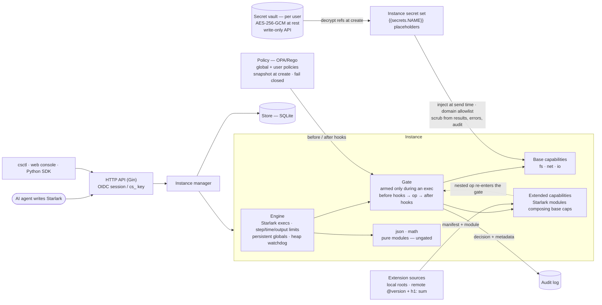

# calcside

A lightweight code-execution sandbox for AI agents, built on Starlark. There are no containers and no host processes: **capabilities are the security boundary**. An agent writes a Starlark script; the only globals it sees are the capabilities it was granted, and every operation those capabilities perform is gated, policy-checked, and audited.

The design follows [citron](https://github.com/mishudark/citron), a Go implementation of the capability-safe agent harness from *[Tracking Capabilities for Safer Agents](https://arxiv.org/abs/2603.00991)* (Odersky et al., CAIS '26). Where the paper enforces safety statically via Scala 3 capture checking and citron via AST analysis, calcside takes the runtime route: a per-instance **Gate** mediates every side effect, Rego policies can veto ops before and after they run, and secrets are injected into outbound requests at send time — scripts can reference them but never read them.

## Architecture



Every capability call — including the base-capability calls an extension makes internally — flows through the same pipeline: **armed check → before hooks (policy veto) → op → after hooks → audit record**. When an exec ends the Gate is disarmed, so capability references that leak past their exec fail with `out_of_scope`.

## Concepts

- **Auth**: Google SSO (OIDC) sessions for humans; `cs_` API keys for tools — sha256-hashed at rest, managed only from a logged-in session, unable to mint new keys. `--dev` skips login (anonymous principal, loopback-only).
- **Instance**: a long-lived Starlark interpreter with its own in-memory VFS and persistent globals. It uses a sliding idle TTL; an exec or keepalive renews it. Lifecycle: create / exec / delete / expire.
- **Capability**: the globals an instance is granted. A capability that isn't granted simply doesn't exist in the script.
  - `fs`: in-memory VFS rooted at `/work`, with a quota, a file limit, and a read-only option. Path escapes are rejected.
  - `net`: HTTP with a host allowlist (exact, `*.suffix`, or `host:port`). Self-resolved DNS, IP pinning, blocking of internal addresses, and redirect re-checks. Private addresses are rejected by default (`--net-allow-private`).
  - `io`: `print` / `io.println`, with bounded output.
  - `ext`: **extended capabilities** — Starlark modules that compose base capabilities into higher-level ops (e.g. a `search` op built on `net`). Declared by a `capability.yaml` manifest (name, version, dependencies, ops, config); every nested op still routes through the Gate. Sources are opt-in on the server: local directories (`--ext-local-roots`) or remote git refs (`--ext-allow-sources`, cached under `--ext-cache-dir`); remote sources must be pinned `@version` with an `h1:` integrity sum, and require the git CLI at fetch time. See [docs/extensions.md](docs/extensions.md) for how to write and distribute one; `examples/capabilities/tavily` is a complete example.
  - `json` and `math` are pure modules and are always available.
- **Env**: `spec.env` is a map of non-sensitive `SCREAMING_SNAKE` values readable via the frozen `env` dict (`env.get("X")`, `env["X"]`, `env.keys()`).
- **Secret**: a value scripts can never read. Reference one as `{{secrets.NAME}}` in net URLs, header values, or bodies — the net capability injects the plaintext at send time, only when the target host matches the secret's domain allowlist (https required unless `--secrets-allow-http`), and scrubs it from responses, errors, audit, and policy input. The `secrets` global exposes only `secrets.names()`.
  - **Inline** secrets are per-instance: `value` + `allowed_domains` in the spec, memory-only, never persisted (the stored spec shows `"source": "inline"`).
  - **Vault refs** (`{"ref": "NAME", "allowed_domains": [narrowed]}`) resolve at creation from the user's vault. Vault secrets are encrypted at rest with `--secret-key` (AES-256-GCM, base64 32-byte key) and write-only via the session-only `/api/v1/secrets` endpoints. An instance ref may only *narrow* the vault allowlist.
  - Response redaction is best-effort defense in depth — it catches raw, base64, URL- and JSON-escaped reflections, not arbitrary server-side transforms — so `allowed_domains` must only list hosts trusted with the secret.
- **Hook**: every op of every capability goes through the instance's Gate: `before hooks -> op -> after hooks -> audit`. Once an exec ends, the Gate is disarmed; once the instance is deleted, it is revoked. Any capability reference that leaks out of an exec then fails with `out_of_scope`.
- **Policy**: OPA/Rego, `package calcside.hooks`, `deny contains msg if {...}`.
  - Global policies come from `--policy-dir`.
  - User policies are compiled and evaluated separately. They run under a restricted builtin set (no `http.send`, `opa.runtime`, `net.lookup_ip_addr`, `print`, or `trace`).
  - Policy snapshots are taken when an instance is created. Evaluation errors or timeouts count as deny (fail closed).

Policy input:

```json
{"phase": "before|after", "user": {"id", "email"}, "instance": {"id", "labels"},
 "exec_id": "...", "capability": "net", "op": "get",
 "args": {"method", "url", "host", "port", "scheme", "secrets": ["NAME"]},
 "result": {"error": null, "meta": {"status": 200, "bytes": 123}}}
```

`args.url` is the placeholder template (e.g. containing `{{secrets.NAME}}`), never an expanded value; `args.secrets` lists the referenced secret names. `result` is only present in the after phase. It never contains file contents or response bodies. See `policies/examples/`.

## Quick start

```bash
make build                 # web console + bin/calcside + bin/csctl
make dev                   # backend (--dev, anonymous) on :8787 + Vite console on :5173 — no login
bin/csctl login --server http://localhost:8080 --api-key cs_...
bin/csctl run --fs -c 'fs.write("a.txt", "hi"); print(fs.read("a.txt"))'
```

Instance spec (`POST /api/v1/instances`):

```json
{"ttl_seconds": 900, "labels": {"team": "x"},
 "capabilities": {"fs": {"quota_bytes": 67108864}, "net": {"allow_hosts": ["api.github.com"]}, "io": {}},
 "limits": {"exec_timeout_ms": 30000, "max_steps": 10000000, "max_output_bytes": 1048576}}
```

## Security model and known limits

- The Starlark language has no I/O. All side effects go through capabilities, and every capability call is gated, policy-checked, and audited.
- CPU is bounded by `max_steps` and the exec timeout. Memory is bounded per call by the fs quota and the net response cap. Starlark itself has no per-exec memory accounting, so a process-wide heap watchdog (`--exec-memory-limit`) cancels all running execs when the limit is exceeded. That is a coarse guard, not per-tenant isolation. For stronger isolation, spread instances across multiple processes or nodes.
- Instance state lives only in memory. After a restart, instances are marked `lost`. The `Snapshotter` interface is reserved (currently a Noop).

## LangChain integration

`sdk/python` ships a `calcside` client and `CalcsideMiddleware` for
LangChain v1 agents. It registers `calcside_exec` / `calcside_list_files` /
`calcside_read_file` tools and injects a system prompt describing the
granted capabilities, Starlark-vs-Python differences, and secret/env
usage.

```python
from langchain.agents import create_agent
from calcside.langchain import CalcsideMiddleware

agent = create_agent(model, tools=[], middleware=[
    # fresh sandbox per run, deleted afterwards:
    CalcsideMiddleware(spec={"capabilities": {"fs": {}}, "ttl_seconds": 900}),
    # or reuse one across runs: CalcsideMiddleware(instance_id="ins_...")
])
```

See [sdk/python/README.md](sdk/python/README.md) for install, modes, and
lifecycle details.
